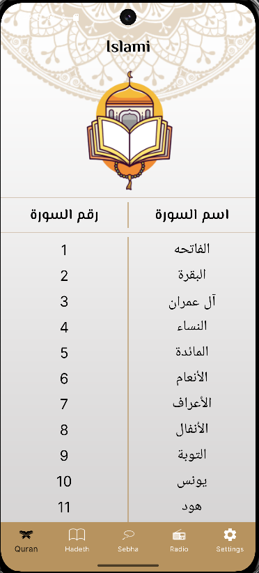
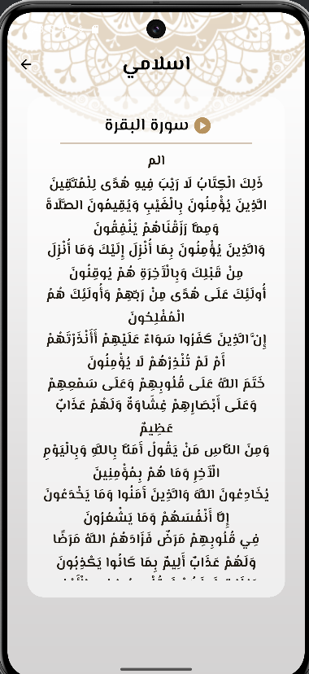
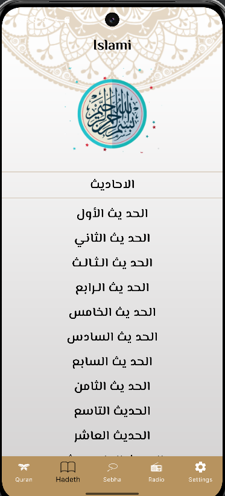
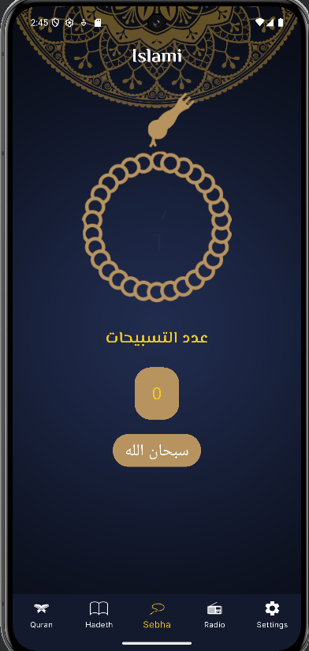
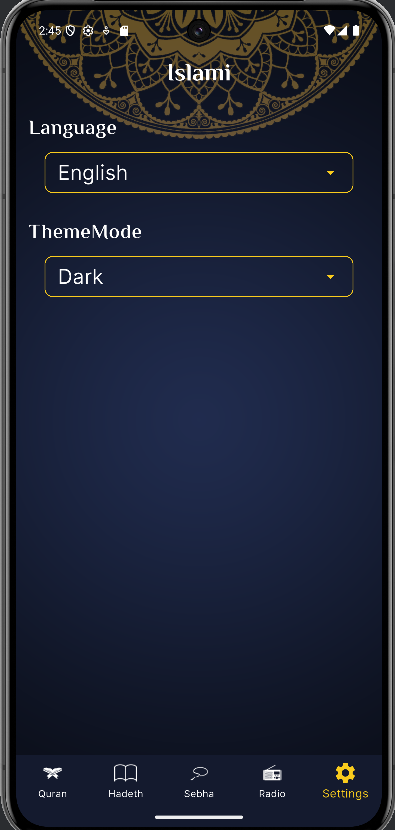

# islamic_app

Isalmi app helps users to view the Quran and hadith and use the Sabha and also
helps users to listen to the Quran on the radio.

## App ScreenShots

### 📽️ Demo Video

[▶️ Watch the video](https://drive.google.com/file/d/1ihWg0knvlLfIihl6clGPXDBk7NcnGPmg/view?usp=drive_link)
